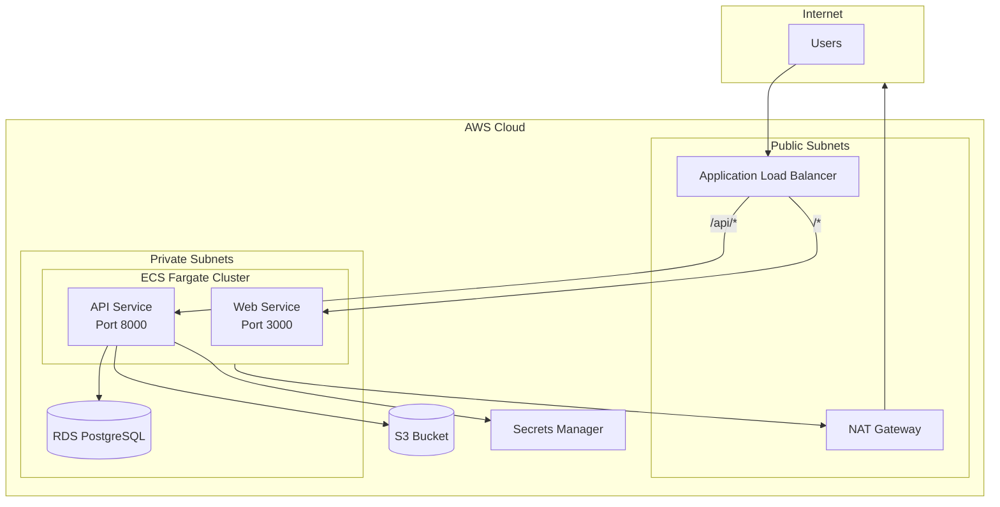

# Infrastructure (`infra/`)

This directory contains Infrastructure as Code (IaC) for deploying the fullstack template to AWS using Terraform.

## Contents

- `terraform/` - Terraform configuration for AWS infrastructure

## Quick Start

### Prerequisites

1. [Terraform](https://www.terraform.io/downloads) >= 1.5.0
2. [AWS CLI](https://aws.amazon.com/cli/) configured with credentials
3. An AWS account with appropriate permissions

### Initial Setup

```bash
cd infra/terraform

# Copy example variables
cp terraform.tfvars.example terraform.tfvars

# Edit terraform.tfvars with your values
# IMPORTANT: Update at minimum:
# - db_password (use a strong password)
# - jwt_secret (use a long random string)
# - s3_bucket_name (must be globally unique)
# - api_image / web_image (your GHCR image paths)

# Initialize Terraform
terraform init

# Create a workspace (dev or prod)
terraform workspace new dev
# or
terraform workspace select dev

# Review the plan
terraform plan

# Apply the infrastructure
terraform apply
```

### Workspaces (Environments)

This configuration uses Terraform workspaces for environment separation:

```bash
# Create environments
terraform workspace new dev
terraform workspace new prod

# Switch between environments
terraform workspace select dev
terraform workspace select prod

# List workspaces
terraform workspace list
```

Each workspace has different default configurations:

| Setting | Dev | Prod |
|---------|-----|------|
| RDS Instance | db.t4g.micro | db.t4g.small |
| RDS Multi-AZ | No | Yes |
| ECS Task Count | 1 | 2 |
| ECS CPU/Memory | 256/512 | 512/1024 |
| NAT Gateways | 1 | 2 |

## Architecture



**Traffic Flow:**
- Users access the Application Load Balancer via HTTP/HTTPS
- ALB routes `/api/*` requests to the API service, all other requests to the Web service
- ECS tasks run in private subnets, accessing the internet via NAT Gateway
- RDS PostgreSQL is only accessible from ECS tasks
- Secrets Manager stores DATABASE_URL, JWT_SECRET, and app credentials

## Modules

### `modules/networking/`
- VPC with configurable CIDR
- Public and private subnets across 2 AZs
- Internet Gateway and NAT Gateway(s)
- Security groups for ALB, ECS, and RDS

### `modules/database/`
- RDS PostgreSQL 16 instance
- Automated backups (7-day retention)
- Performance Insights enabled
- Connection info stored in Secrets Manager

### `modules/ecs/`
- ECS Fargate cluster
- Task definitions for API and Web services
- IAM roles for task execution and S3 access
- CloudWatch log groups

### `modules/storage/`
- S3 bucket with versioning
- Server-side encryption (AES-256)
- Lifecycle policy (transition to IA after 90 days)
- CORS configuration for presigned uploads

### `modules/secrets/`
- Secrets Manager secrets for sensitive config
- Database credentials
- JWT signing secret
- App secrets (S3 keys, etc.)

### `modules/loadbalancer/`
- Application Load Balancer
- HTTP/HTTPS listeners
- Target groups for API and Web
- Path-based routing (`/api/*` → API, else → Web)

## Configuration

### Required Variables

| Variable | Description |
|----------|-------------|
| `db_password` | PostgreSQL master password |
| `jwt_secret` | JWT signing secret |
| `s3_bucket_name` | Globally unique S3 bucket name |

### Optional Variables

| Variable | Default | Description |
|----------|---------|-------------|
| `project_name` | `fullstack-template` | Resource naming prefix |
| `aws_region` | `us-east-1` | AWS region |
| `vpc_cidr` | `10.0.0.0/16` | VPC CIDR block |
| `enable_https` | `false` | Enable HTTPS (requires `certificate_arn`) |

See `terraform.tfvars.example` for all available options.

## HTTPS Setup

To enable HTTPS:

1. Request an ACM certificate for your domain:
   ```bash
   aws acm request-certificate \
     --domain-name your-domain.com \
     --validation-method DNS
   ```

2. Complete DNS validation

3. Add to `terraform.tfvars`:
   ```hcl
   certificate_arn = "arn:aws:acm:us-east-1:123456789:certificate/abc-123"
   enable_https    = true
   ```

4. Apply changes: `terraform apply`

## Remote State (Teams)

For team environments, configure S3 backend for state storage:

1. Create state bucket and DynamoDB table:
   ```bash
   aws s3api create-bucket --bucket your-tf-state-bucket --region us-east-1
   aws s3api put-bucket-versioning --bucket your-tf-state-bucket \
     --versioning-configuration Status=Enabled
   aws dynamodb create-table --table-name terraform-locks \
     --attribute-definitions AttributeName=LockID,AttributeType=S \
     --key-schema AttributeName=LockID,KeyType=HASH \
     --billing-mode PAY_PER_REQUEST
   ```

2. Uncomment the backend configuration in `backend.tf`

3. Re-initialize: `terraform init -migrate-state`

## Deployment Workflow

### Initial Deployment

1. Configure AWS credentials
2. Update `terraform.tfvars`
3. Run `terraform init && terraform apply`
4. Note the outputs (ALB DNS, etc.)
5. Update DNS to point to ALB

### Updating Services

After pushing new images to GHCR:

```bash
# Update ECS services to pull latest images
aws ecs update-service --cluster fullstack-template-dev-cluster \
  --service fullstack-template-dev-api --force-new-deployment

aws ecs update-service --cluster fullstack-template-dev-cluster \
  --service fullstack-template-dev-web --force-new-deployment
```

### Running Migrations

```bash
# Run migration as a one-off ECS task
aws ecs run-task \
  --cluster fullstack-template-dev-cluster \
  --task-definition fullstack-template-dev-api \
  --launch-type FARGATE \
  --network-configuration "awsvpcConfiguration={subnets=[subnet-xxx],securityGroups=[sg-xxx]}" \
  --overrides '{"containerOverrides":[{"name":"api","command":["python","scripts/migrate.py","upgrade"]}]}'
```

## Cost Estimates

Approximate monthly costs for a minimal deployment:

| Resource | Dev | Prod |
|----------|-----|------|
| ECS Fargate (2 tasks) | ~$30 | ~$60 |
| RDS PostgreSQL | ~$15 | ~$30 |
| ALB | ~$20 | ~$20 |
| NAT Gateway | ~$35 | ~$70 |
| S3 | ~$5 | ~$5 |
| Secrets Manager | ~$1 | ~$1 |
| **Total** | **~$106** | **~$186** |

Cost reduction tips:
- Use RDS Reserved Instances (1-year commitment)
- Consider Fargate Spot for non-critical workloads
- Review NAT Gateway usage (significant cost driver)

## Troubleshooting

### ECS Tasks Not Starting

1. Check CloudWatch logs: `/ecs/{name_prefix}/api` or `/ecs/{name_prefix}/web`
2. Verify security groups allow traffic
3. Check that images are accessible (GHCR permissions)
4. Verify Secrets Manager access

### Database Connection Issues

1. Verify security group allows ECS → RDS on port 5432
2. Check DATABASE_URL secret is populated correctly
3. Test from within VPC using ECS Exec

### Health Check Failures

1. API: Verify `/health` endpoint responds with 200
2. Web: Verify `/` responds with 200
3. Check task logs for startup errors

## CI Integration

The CI workflow validates Terraform configuration on every PR:

- `terraform fmt -check` - Format validation
- `terraform init -backend=false` - Initialization
- `terraform validate` - Configuration validation

See `.github/workflows/ci.yml` for details.
